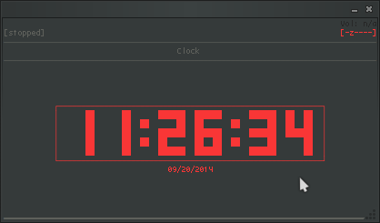

# WinTTY Clock – TTY-style Console Clock for Windows
🕒 Элегантные консольные часы для Windows в стиле TTY с поддержкой ASCII-арта и настраиваемых цветов
[](https://github.com/Tiwerrrr/clock/releases/latest/download/clock.exe)

Простые консольные часы для Windows, как в Linux:

- Постоянно обновляются в центре экрана
- Обычные и ASCII-часы
- Цвет можно задать через HEX
- Секунды по желанию
- Ctrl+C аккуратно завершает и очищает консоль
- Заголовок адаптируется под язык системы (`Clock`/`Часы`)

## Скриншоты

### TTY-style ASCII Clock


### Standard Windows Clock


### ASCII Windows Clock


## Аргументы

| Аргумент        | Описание |
|-----------------|---------|
| `#RRGGBB`       | Цвет часов (HEX), например `#00FFFF` — голубой |
| `-s`            | Показывать секунды |
| `-ascii`        | ASCII-версия часов (большие символы) |

## Примеры использования

```cmd
clock                 # Обычные голубые часы
clock -s              # Обычные часы с секундами
clock #FF0000 -ascii  # ASCII-часы красные
clock #00FF00 -s      # Зеленые часы с секундами
clock #FF00FF -s -ascii  # ASCII-часы фиолетовые с секундами
```

## Установка

1. [Скачайте Clock.exe](https://github.com/Tiwerrrr/clock/releases/latest/download/clock.exe) с релизов GitHub

2. Скопируйте его в любую папку из PATH, например:

```cmd
copy Clock.exe C:\Windows\
```

3. Теперь можно запускать часы из любой консоли командой:

```cmd
clock
```
