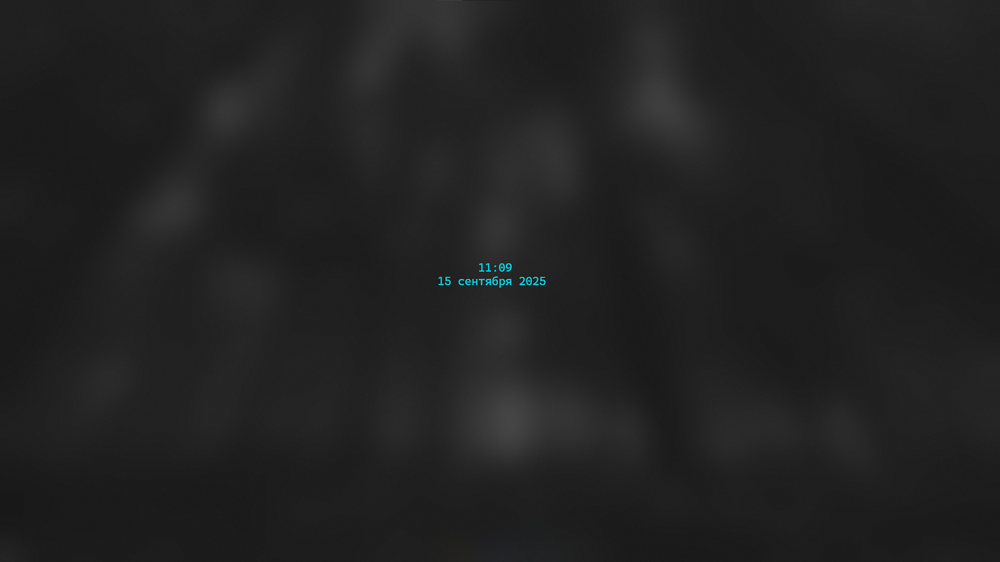

# WinTTY Clock – TTY-style Console Clock for Windows

[](https://github.com/Tiwerrrr/WinTTY-Clock/releases/latest/download/clock.exe)

Простые консольные часы в стиле tty для Windows:
- Центрируются по окну, обновляются каждые 100 мс
- Обычные блоки или ASCII-режим
- Цвет задаётся в HEX
- Секунды по флагу
- Корректно скрывают курсор и очищают вывод при выходе (Ctrl+C)
- Локализуют название месяца по системной локали (ru/en)

## Скриншоты

### TTY-style ASCII Clock


### Standard Windows Clock


### ASCII Windows Clock


## Аргументы

| Аргумент  | Описание |
|-----------|----------|
| `#RRGGBB` | Цвет часов (HEX), например `#00FFFF` — голубой |
| `-s`      | Показывать секунды |
| `-ascii`  | ASCII-версия часов (символ `#` вместо блока) |

## Примеры

```cmd
clock                 # Обычные голубые часы
clock -s              # Обычные часы с секундами
clock #FF0000 -ascii  # ASCII-часы красные
clock #00FF00 -s      # Зеленые часы с секундами
clock #FF00FF -s -ascii  # ASCII-часы фиолетовые с секундами
```

## Установка

1) Скачайте [clock.exe](https://github.com/Tiwerrrr/WinTTY-Clock/releases/latest/download/clock.exe).
2) Скопируйте в папку из PATH, например:
```cmd
copy clock.exe C:\Windows\
```
3) Запускайте из любой консоли:
```cmd
clock
```

## Релиз

- Версия: `1.1.0`
- Имя для релиза: `WinTTY Clock 1.1.0`
